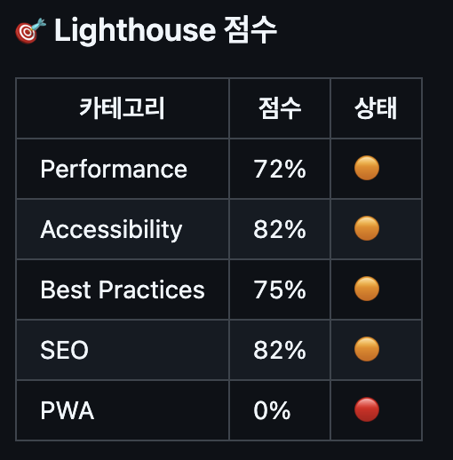
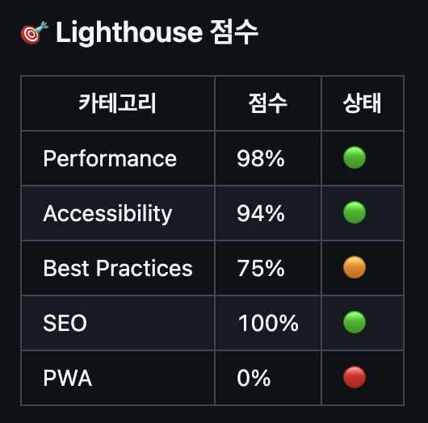
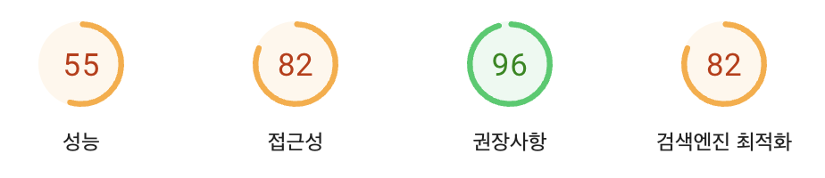
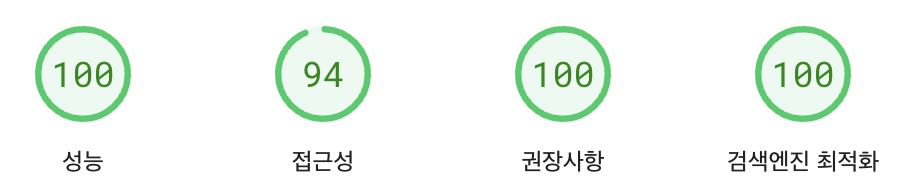
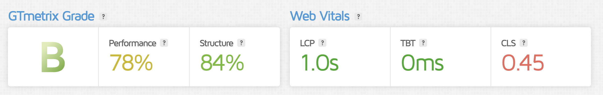
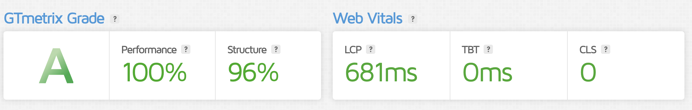

# 성능 개선 보고서

## 측정 도구

- Lighthouse (issued by github action)
- [PageSpeed Insight](https://pagespeed.web.dev/)
- [GTmetrix](https://gtmetrix.com/)

## 분석 지표

1. 로딩 성능
   - FCP (First Content Paint): 최초 콘텐츠 렌더링 시간
   - LCP (Largest Content Paint): 최대 콘텐츠 렌더링 시간
   - TTI (Time to Interactive): 상호작용 가능 시간
   - TBT (Total Blocking Time): 총 차단 시간
   - Speed Index: 페이지 로딩 속도 지표

2. 렌더링 성능
   - CLS (Cumulative Layout Shift): 누적 레이아웃 이동

3. 자바스크립트 성능
   - 실행 시간 (DOM Content/Interactive/Onload Time)

4. 네트워크 성능
   - Resource Size: 리소스 크기
   - Number of Requests: 요청 수
   - TTFB (Time to First Byte): 최초 바이트 수신 시간

## 성능 측정 전후 결과 비교

### 종합 비교

|항목|성능 개선 전|성능 개선 후|
|--|--|--|
|Lighthouse|[개선 전](https://github.com/cruellaDev/front_3rd_chapter4-2_basic/issues/4)|[개선 후](https://github.com/cruellaDev/front_3rd_chapter4-2_basic/issues/17)|
||||
|PageSpeed Insight|[개선 전](https://pagespeed.web.dev/analysis/https-d1yhvyw2o9r6xp-cloudfront-net/0d6rudrsdl?form_factor=desktop)|[개선 후](https://pagespeed.web.dev/analysis/https-d1yhvyw2o9r6xp-cloudfront-net/kl4jkfehzb?form_factor=desktop)|
||||
|GTmetrix|[개선 전](https://gtmetrix.com/reports/d1yhvyw2o9r6xp.cloudfront.net/rkflT9WQ/)|[개선 후](https://gtmetrix.com/reports/d1yhvyw2o9r6xp.cloudfront.net/SN1MWxCC/)|
||||

### 로딩 성능

| 지표 | 도구 | 개선 전 | 개선 후 | 개선율 |
|------|------|---------|---------|---------|
| FCP | PageSpeed | 0.9s | 0.2s | 78% |
|  | GTmetrix | 0.338s | 0.285s | 16% |
| LCP | Lighthouse | 14.63s | 2.11s | 86% |
|  | PageSpeed | 2.9s | 0.4s | 86% |
|  | GTmetrix | 1.0s | 0.681s | 32% |
| TTI | GTmetrix | 0.491s | 0.429s | 13% |
| TBT | PageSpeed | 0.2s | 0s | 100% |
|  | GTmetrix | 0s | 0s | 0% |
| Speed Index | PageSpeed | 1.4s | 0.6s | 57% |
|  | GTmetrix | 0.966s | 0.621s | 36% |

### 렌더링 성능

| 지표 | 도구 | 개선 전 | 개선 후 | 개선율 |
|------|------|---------|---------|---------|
| CLS | Lighthouse | 0.011 | 0.001 | 91% |
|  | PageSpeed | 0.477 | 0.002 | 99.6% |
|  | GTmetrix | 0.45 | 0 | 100% |

### 자바스크립트 성능

| 지표 | 개선 전 | 개선 후 | 개선율 |
|------|---------|---------|---------|
| Fully Loaded Time | 1.8s | 0.81s | 55% |
| DOM Content Loaded | 0.492s | 0.429s | 13% |
| DOM Interactive | 0.491s | 0.417s | 15% |
| Onload Time | 0.895s | 0.63s | 30% |

### 네트워크 성능

| 지표 | 개선 전 | 개선 후 | 개선율 |
|------|---------|---------|---------|
| Resource Size | 3.51MB | 0.383MB | 89% |
| Number of Requests | 37 | 17 | 54% |
| TTFB | 0.066s | 0.074s | -12% |

## 개선 사항

### 수행한 작업

1. 이미지 최적화
   - WebP 형식 적용 (2,156KB 절감)
   - 이미지 크기 최적화 (1,806KB 절감)
   - 이미지 인코딩 개선 (1,410KB 절감)
   - 지연 로딩 적용 (1,379KB 절감)

2. 자바스크립트 최적화
   - Google Tag Manager 지연 로딩
   - 쿠키 동의 스크립트 지연 로딩
   - 렌더링 차단 리소스 제거 (420ms 개선)

3. 웹 표준/접근성 개선
   - 이미지 alt 속성 추가
   - HTML 구조 개선
   - 메타 설명 추가

4. 레이아웃 최적화
   - 이미지에 width/height 명시
   - country banner 영역 사전 확보

### 추가 개선 필요 사항

1. Lighthouse 관련
   - 제목 요소 구조 개선
   - 색상 대비율 수정

2. PageSpeed 관련
   - 이미지 추가 최적화 (89KB)
   - 자바스크립트 사용량 개선 (46KB)

3. 기타
   - TTFB 성능 저하 (-12%) 원인 분석 및 개선

## 결론

1. 성능 개선 주요 성과
   - LCP: 14.63s → 2.11s (86% 개선)
   - CLS: 0.477 → 0.002 (99.6% 개선)
   - Resource Size: 3.51MB → 0.383MB (89% 절감)

2. 사용자 경험 개선 효과
   - 페이지 초기 로딩 시간 78% 단축
   - 레이아웃 이동 99.6% 감소
   - 데이터 사용량 89% 절감

3. 추후 개선 계획
   - TTFB 성능 저하 (-12%) 원인 분석 및 개선
   - 자바스크립트 최적화 (46KB)
   - 이미지 추가 최적화 (89KB)
   - 웹 접근성 요소 보완